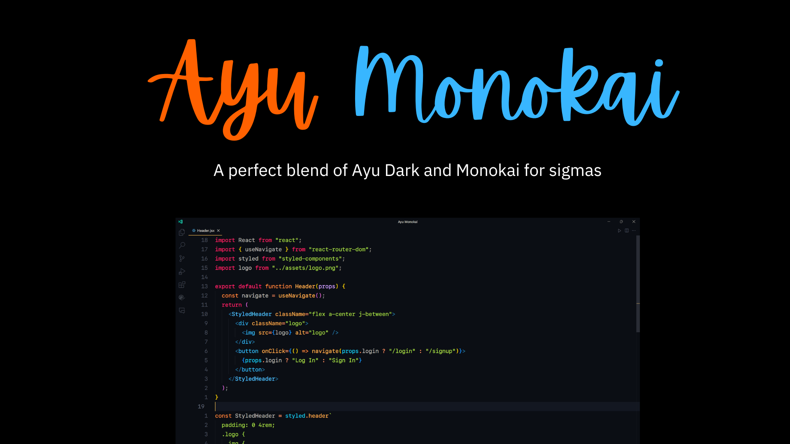
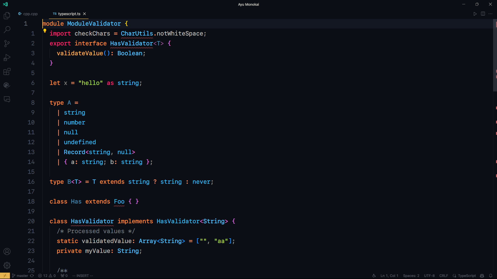
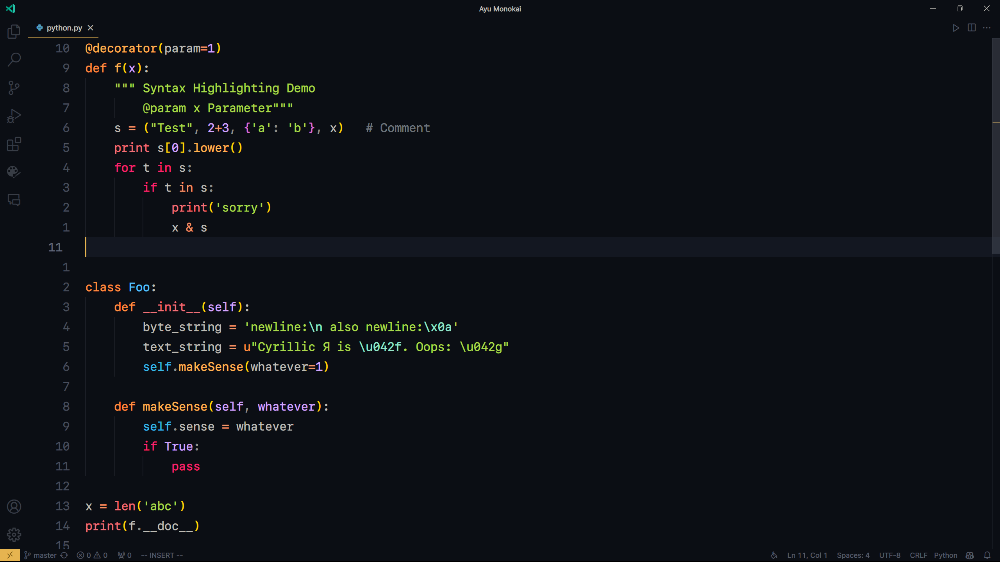
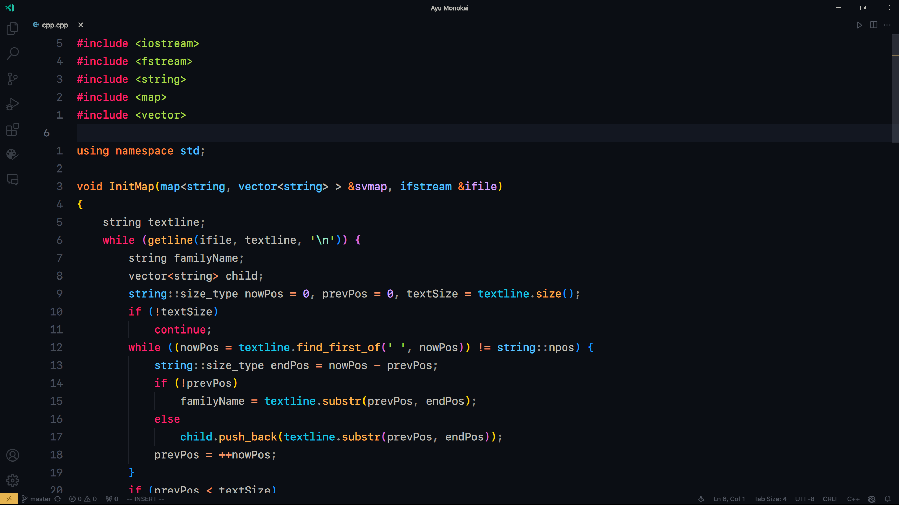
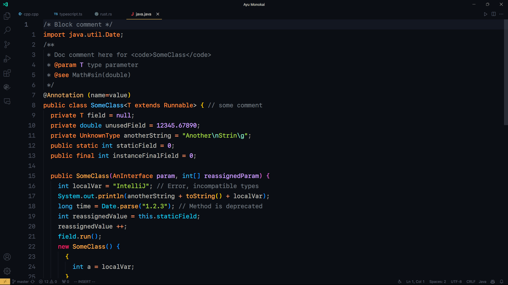
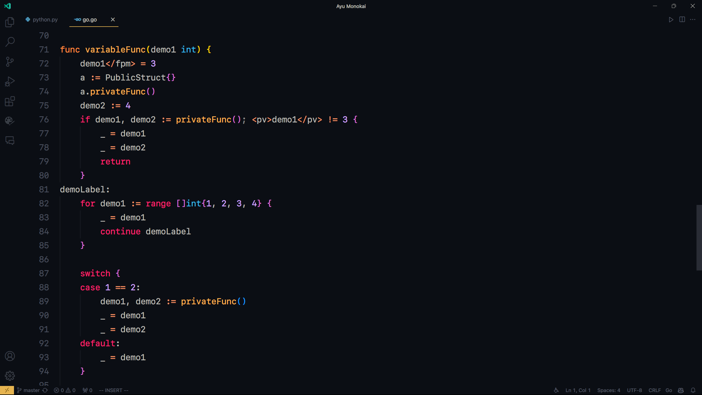
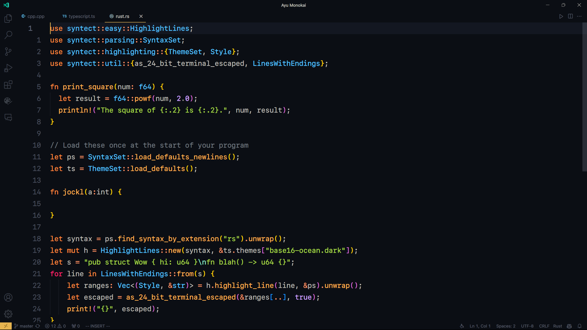
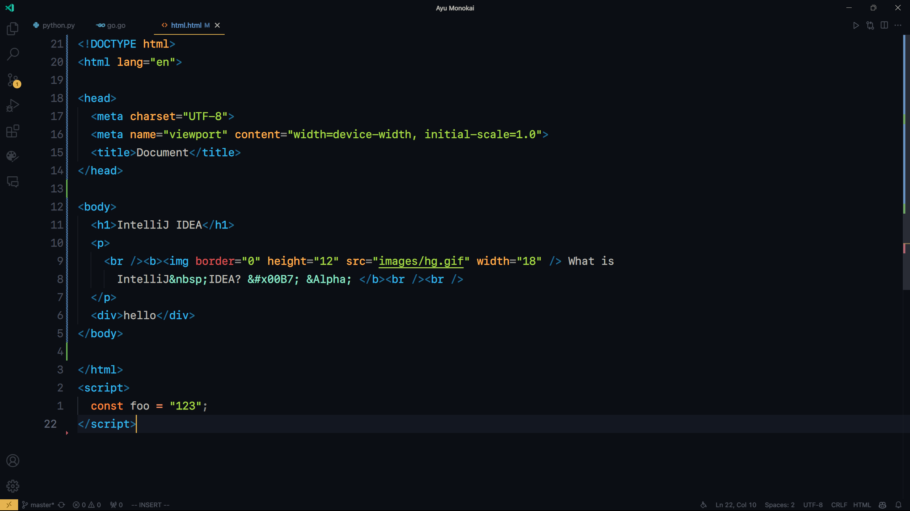
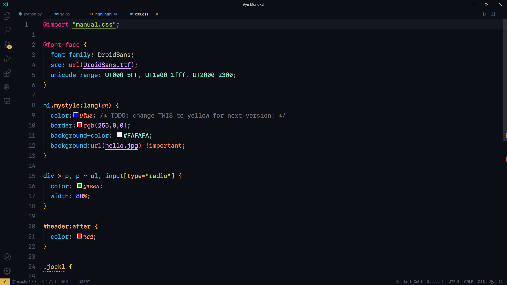

    
     
    
A perfect blend of Ayu Dark and Monokai for sigmas

     
    
     
    

 

<h1 align="center">Screenshots</h1>

<!-- 

    

        
TypeScript

        
    

    

        
Python

        
    

    

        
CPP

        
    

    

        
Java

        
    

    

        
Go

        
    

    

        
Rust

        
    

    

        
HTML

        
    

    

        
CSS

        
    

 -->

TypeScript

Python

CPP

Java

Go

Rust

HTML

CSS

